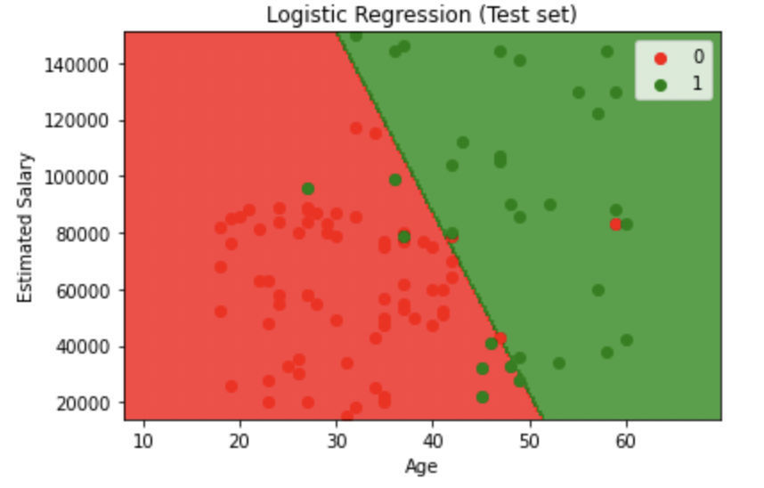
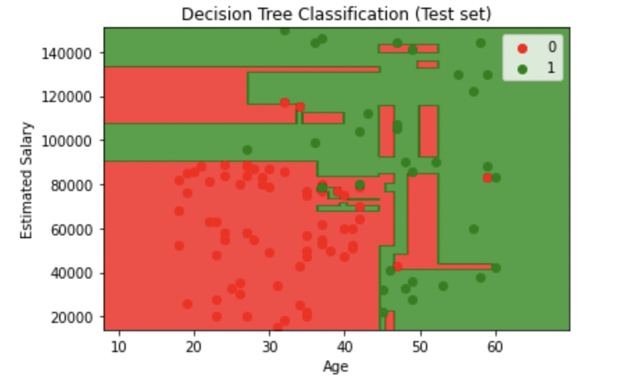
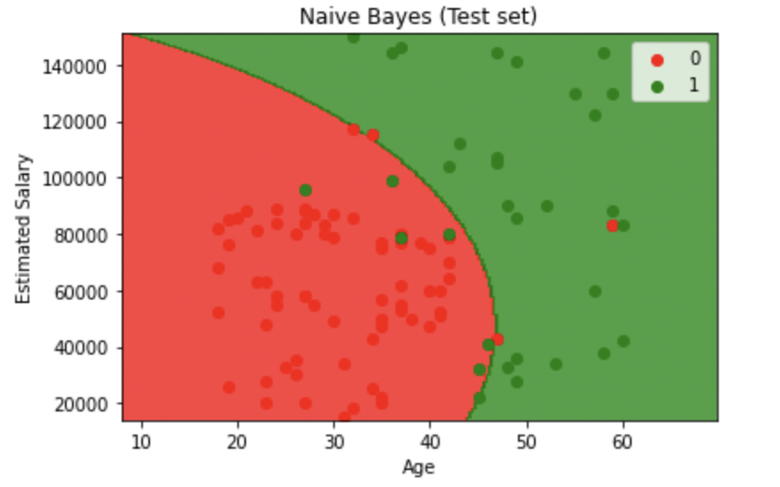
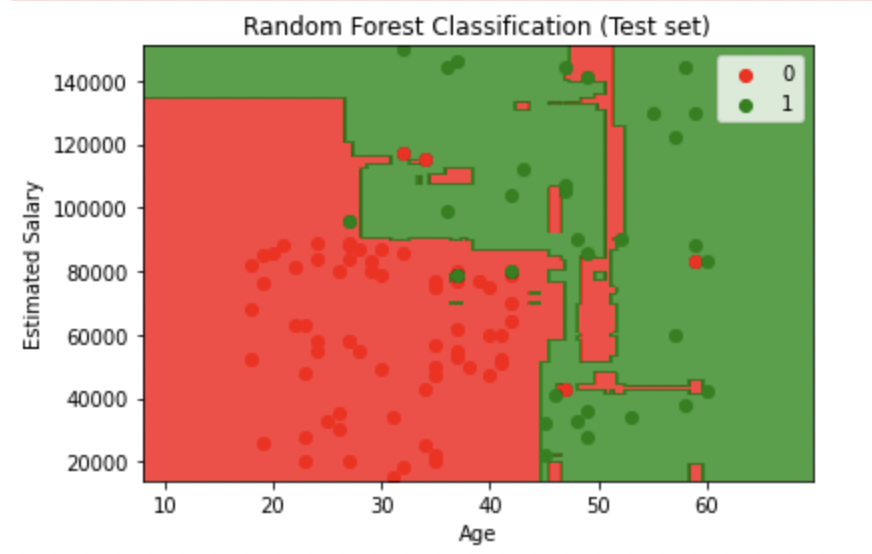
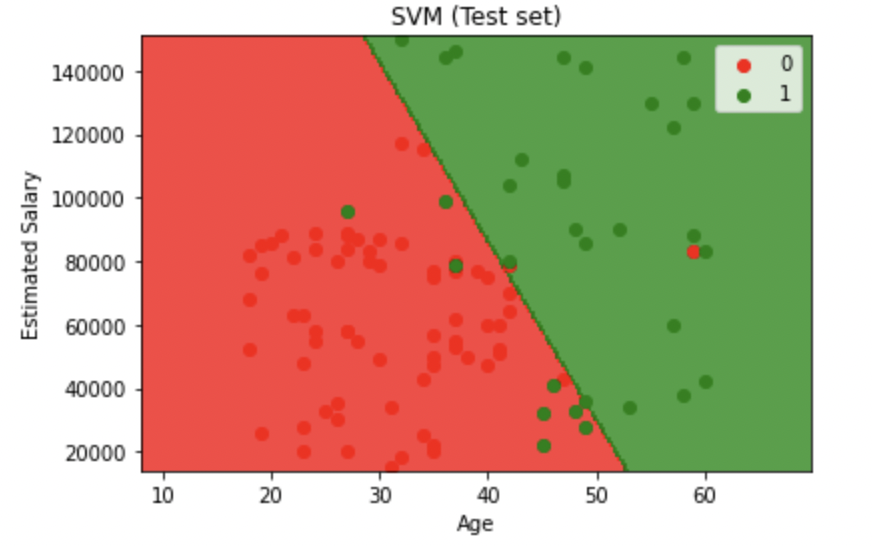
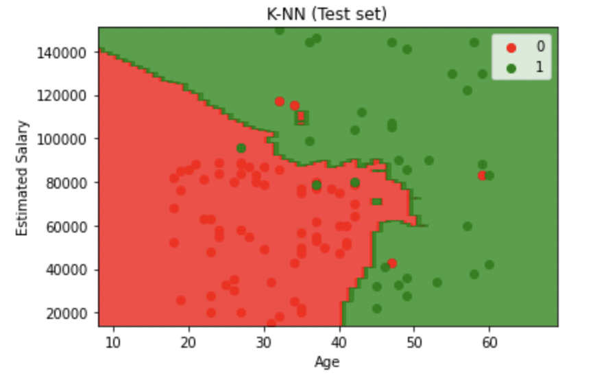

Here’s a detailed and professional README for your **Ad Response Predictor** project:

---

# **Ad Response Predictor**

This project predicts the likelihood of a target customer purchasing an advertised product based on their **age** and **estimated salary**. Various **classification algorithms** are evaluated to determine the best-performing model. 

Visualizations of the classification results on the test data are also provided for each algorithm.

---

## **Algorithms Used**
   - Decision Tree
   - K-Nearest Neighbors (KNN)
   - Logistic Regression
   - Naive Bayes
   - Random Forest
   - Support Vector Machine (SVM)

---

## **Project Overview**
Predicting customer responses to advertisements is crucial for optimizing marketing strategies. This project evaluates multiple classification models to identify the most accurate algorithm for predicting whether a customer will purchase a product after seeing an advertisement.

The dataset contains customer demographic data (age, estimated salary) and whether they purchased the product (target variable).

---

## **Dataset Structure**
The dataset is organized as follows:

```
dataset/
├── Social_Network_Ads.csv
```

- **Columns Include:**
  - **Age:** Age of the user.
  - **Estimated Salary:** Annual salary estimate of the user.
  - **Purchased:** Target variable (1 for purchase, 0 for no purchase).

---

## **Data Preprocessing**
To prepare the dataset for training and evaluation, the following preprocessing steps were applied:

1. **Feature Scaling:**
   - Applied Min-Max scaling to normalize the numerical features (`Age`, `Estimated Salary`) to a range of 0 to 1.

2. **Data Splitting:**
   - Split the dataset into **training** (75%) and **test** (25%) sets.

---

## **Model Building and Results**

### **1. Logistic Regression**
- **Accuracy:** 89% on the test set.  


---

### **2. Decision Tree**
- **Criteria:** Entropy  
- **Accuracy:** 90% on the test set.  


---

### **3. Naive Bayes**
- **Algorithm:** Gaussian Naive Bayes.  
- **Accuracy:** 90% on the test set.  


---

### **4. Random Forest**
- **Configuration:**  
  - **Number of Estimators:** 10  
  - **Criteria:** Entropy  
- **Accuracy:** 91% on the test set.  


---

### **5. Support Vector Machine (SVM)**
- **Kernel:** Linear  
- **Accuracy:** 90% on the test set.  


---

### **6. K-Nearest Neighbors (KNN)**
- **Configuration:**  
  - **Number of Neighbors:** 5  
  - **Distance Metric:** Minkowski  
  - **Parameter p:** 2  (Euclidean distance)
- **Accuracy:** 93% on the test set.  


---

### **Validation**
The accuracy of the models on the test set is used for validation to prevent overfitting to the training data. Since KNN achieves the highest accuracy on the test set, the KNN model with 5 nearest neighbors is selected as the best-performing model for the current dataset.

---

## **Implementation Details**
- **Programming Language:** Python  
- **Libraries Used:**
  - `NumPy`: For numerical computations.  
  - `Pandas`: For data manipulation.  
  - `Matplotlib`: For visualizing decision boundaries and results.  

---

## **How to Use**
### **Prerequisites**
1. Python 3.7+
2. Install required libraries:
   ```bash
   pip install numpy pandas matplotlib
   ```

---

## **Future Improvements**
1. Extend the dataset by including additional features, such as browsing behavior or clickstream data.  
2. Apply hyperparameter tuning to find the optimal number of neighbors with minimal bias and overfitting.  
4. Use ensemble methods to combine the strengths of multiple algorithms.

